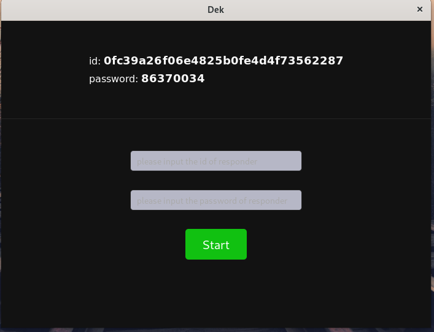
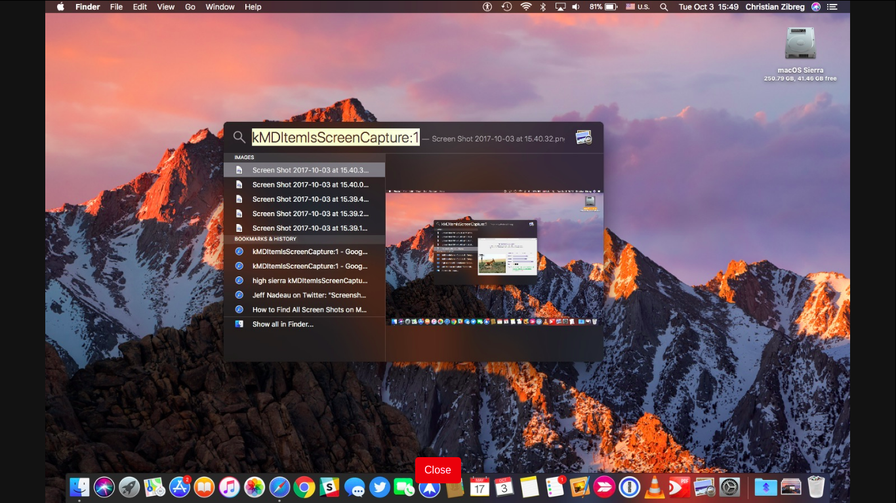

## Intro

Suk is a remote desktop control kit based on WebRTC and Tauri.

Suk consist of two parts of `desktop client` and `remote server`.

The `Client` is installed locally, and responsible for connection establishment, local event collecting and transmission, remote event receiving and performing. 

The `Sever` built with rust [actix](https://actix.rs), can be installed remotely, and act as a bridge when the client establishing the connection. The default address is in the format of 
`<IP-Address>:7856` where the port is 7856 for the client to access.

## ScreenShots

## Known Issues 

- Due to some limitation of current development(2023-01), WebRTC is not supported on webkit2gtk based on which Tauri is built, Suk cannot works in Linux.

